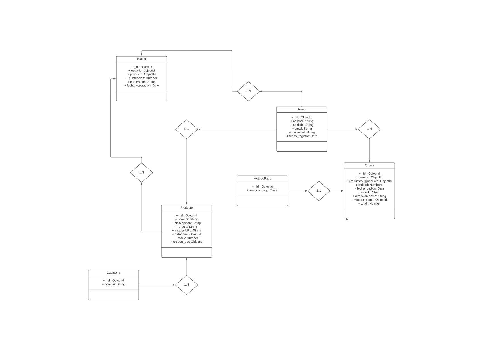

# Propuesta comercial - Miguel Angel Niño Silva
## Idea de proyecto
Desarrollo de un aplicativo web para demostración de la funcionalidad del negocio a nivel operativo
### Descripción
El proyecto consiste en desarrollar un aplicativo web que permita demostrar la funcionalidad del negocio a nivel operativo. El aplicativo se basará en el cuadro tecnológico MERN (MongoDB, Express, React, Node.js) y contará con las siguientes características:

- Registro de usuarios
- Inicio de sesión
- Gestión de productos

### Objetivo
- Demostrar la funcionalidad del negocio a nivel operativo
- Obtener feedback de los usuarios para mejorar el producto
- Validar la viabilidad del negocio

### Colecciones
- Usuario
- Orden
- MetodoPago
- Producto
- Categoria
- Rating

## Diagrama

